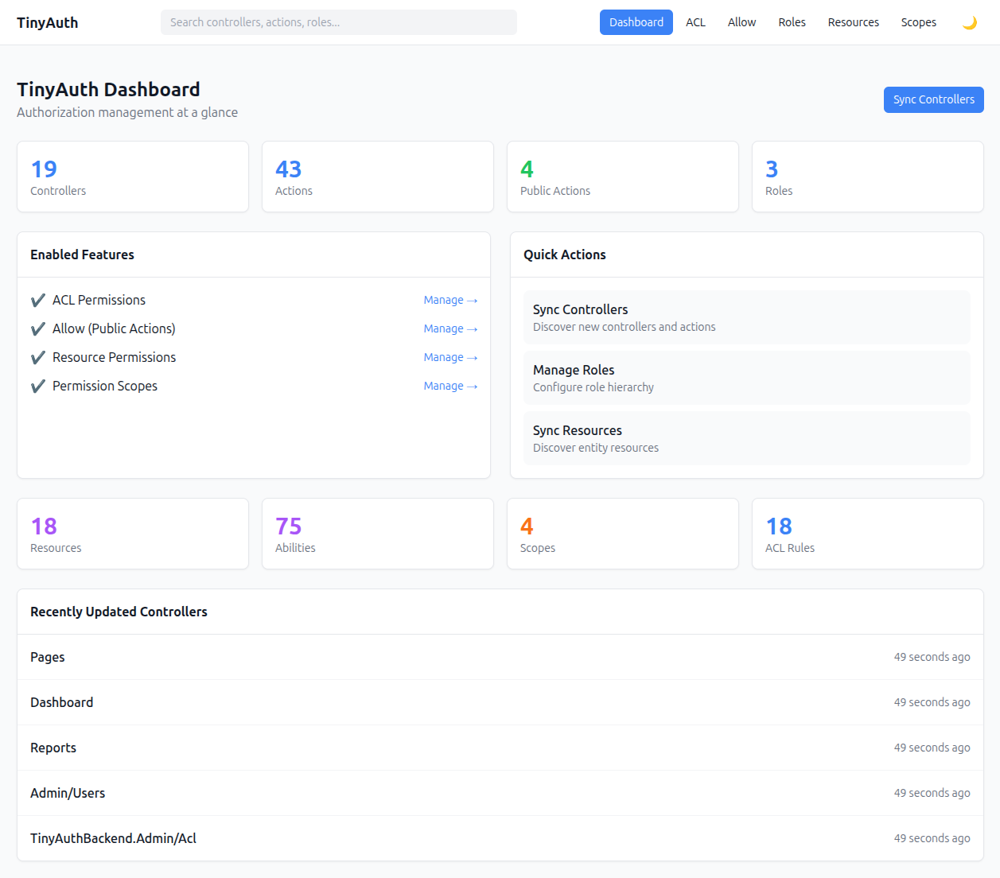

# Overview

**TinyAuthBackend** gives you a database-backed admin UI for permissions and
roles in CakePHP. It is a companion to the
[TinyAuth plugin](https://github.com/dereuromark/cakephp-tinyauth) and replaces
the native INI file approach with editable database tables.

::: info CakePHP version
This documentation is for the branch that supports **CakePHP 5.1+**. See the
[version map](https://github.com/dereuromark/cakephp-tinyauth-backend/wiki#cakephp-version-map)
for older releases.
:::

## What you get

- A self-contained admin UI mounted at `/admin/auth`.
- Drop-in adapters (`DbAllowAdapter`, `DbAclAdapter`) that let TinyAuth read
  `allow` and `acl` rules from the database instead of INI files.
- Optional resources, abilities, scopes, and role hierarchy for entity-level
  authorization.
- `TinyAuthPolicy` and `TinyAuthResolver` for integration with the
  [cakephp/authorization](https://github.com/cakephp/authorization) plugin.



## Four usage strategies

The package supports four practical usage strategies, arranged as a ladder you
can climb as your project's needs grow:

1. **Adapter-only TinyAuth** — keep classic TinyAuth `allow` + `acl` behavior,
   but store those rules in the database instead of INI files.
2. **Full TinyAuthBackend** — use the admin UI plus resources, scopes, role
   hierarchy, and `TinyAuthPolicy` / `TinyAuthService` for entity authorization.
3. **Backend UI + native CakePHP auth** — keep CakePHP Authentication /
   Authorization as your runtime layer and use this package mainly as a
   DB-backed permission management UI.
4. **External role source** — drive role aliases from a JWT claim, an LDAP
   group, an SSO gateway, or any other source outside the plugin, while keeping
   ACL / resource assignments in the backend.

See the [Strategies overview](/strategies/) for a comparison and pick the one
that fits your app.

## The admin URL

The plugin mounts under:

```text
/admin/auth
```

Common sections:

| URL | Purpose |
|-----|---------|
| `/admin/auth/allow` | Public action management |
| `/admin/auth/acl` | Controller/action ACL matrix |
| `/admin/auth/roles` | Roles and hierarchy |
| `/admin/auth/resources` | Resource abilities |
| `/admin/auth/scopes` | Field-based scopes |
| `/admin/auth/sync/controllers` | Scan controllers/actions into the database |
| `/admin/auth/sync/resources` | Scan entities/resources into the database |

::: danger Access is fail-closed
The admin UI manages authorization rules, so accidental exposure is
**RCE-equivalent**. The plugin rejects every admin request with `403` until you
configure an explicit gate. See [Admin Access](/guide/admin-access).
:::

## Next steps

- [Installation](/guide/installation) — install the plugin and run the migrations.
- [Admin Access](/guide/admin-access) — configure who may manage `/admin/auth`.
- [Strategies](/strategies/) — choose how deeply you integrate the backend.
- [Permissions](/permissions/roles) — roles, public actions, ACL, resources, and scopes.
