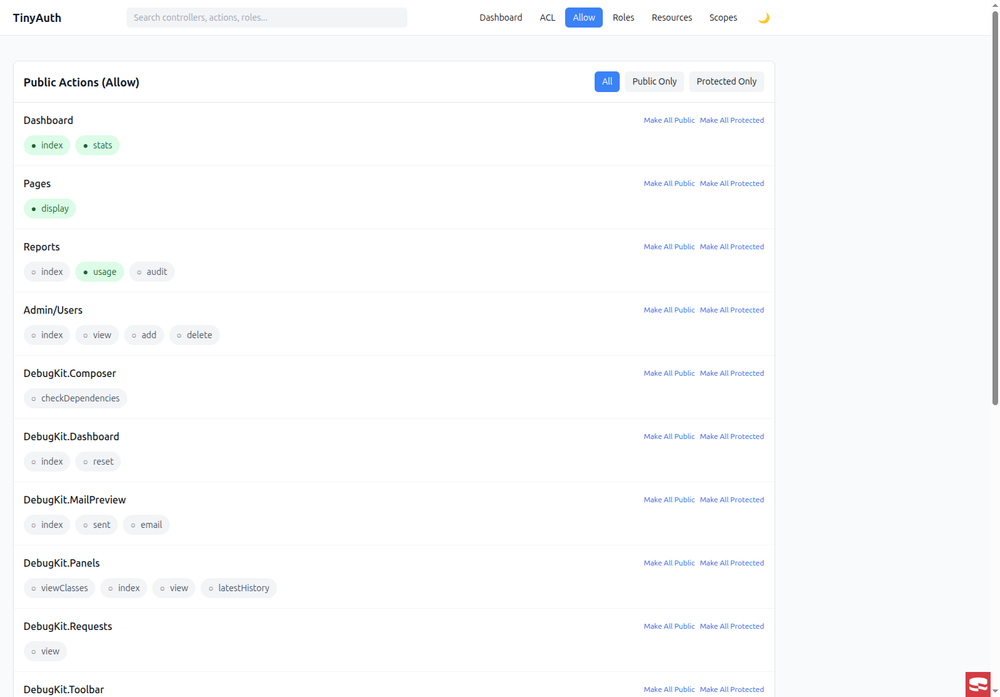

# Allow (Public Actions)

The Allow page lets you mark actions as publicly accessible — no authentication
required.



## Overview

Public actions bypass authentication entirely: anyone can access them without
logging in.

Common examples:

- `Pages::display` — static pages
- `Users::login` — login page
- `Users::register` — registration page
- API endpoints that don't require auth

## Interface

The Allow page displays all controllers with their actions:

- **Toggle switch** — enable/disable public access per action
- **Bulk actions** — make all actions in a controller public/protected

### Setting public actions

1. Find the controller in the list.
2. Toggle the switch next to the action.
3. Green = public, gray = protected.

### Bulk operations

For each controller, you can:

- **Make all public** — set all actions to public
- **Make all protected** — remove public access from all actions

### Filter options

Filter the view by:

- **All** — show all actions
- **Public** — show only public actions
- **Protected** — show only protected actions

## Database schema

Public actions are stored in the `tinyauth_actions` table:

```sql
CREATE TABLE tinyauth_actions (
    id INT AUTO_INCREMENT PRIMARY KEY,
    controller_id INT NOT NULL,
    name VARCHAR(100) NOT NULL,
    is_public BOOLEAN DEFAULT FALSE,  -- This field
    created DATETIME,
    modified DATETIME
);
```

## Programmatic access

```php
use TinyAuthBackend\Service\TinyAuthService;

$service = new TinyAuthService();

// Check if action is public
$isPublic = $service->isPublicAction('Pages', 'display');

// Check with plugin/prefix
$isPublic = $service->isPublicAction('Articles', 'view', [
    'plugin' => 'Blog',
]);
```

### Making actions public programmatically

```php
$actionsTable = $this->fetchTable('TinyAuthBackend.Actions');

// Find the action
$action = $actionsTable->find()
    ->matching('TinyauthControllers', function ($q) {
        return $q->where([
            'TinyauthControllers.name' => 'Pages',
            'TinyauthControllers.plugin IS' => null,
            'TinyauthControllers.prefix IS' => null,
        ]);
    })
    ->where(['Actions.name' => 'display'])
    ->first();

// Make it public
$action->is_public = true;
$actionsTable->save($action);

// Clear cache
Cache::delete('TinyAuth.allow');
```

## Integration with TinyAuth

The `DbAllowAdapter` reads from the normalized tables:

```php
// In config/app.php
'TinyAuth' => [
    'allowAdapter' => \TinyAuthBackend\Auth\AllowAdapter\DbAllowAdapter::class,
],
```

The adapter returns data in TinyAuth's expected format:

```php
// Returns an array like:
[
    'Pages' => ['display', 'home'],
    'Users' => ['login', 'register'],
    'Blog.Articles' => ['index', 'view'],
]
```

## Security considerations

::: warning Review public actions regularly
- Be cautious when making actions public.
- Use the filter to audit which actions are currently public.
- Consider role-based access instead of public access when possible.
:::

## See also

- [Public Actions concept](/authorization/authentication) — the runtime view.
- [ACL Matrix](/permissions/acl) — role-based controller/action permissions.
