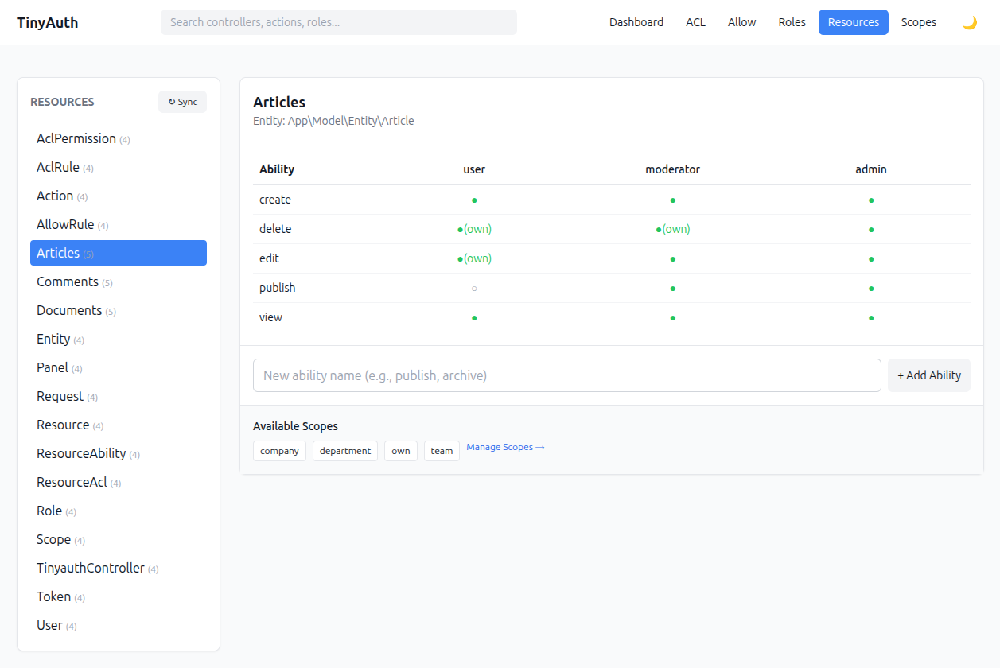

# Resources

Resources are the entity-level part of the backend.



They answer questions like:

- "Can this user edit this article?"
- "Can moderators delete comments?"
- "Can users edit only their own records?"

## Data model

- **Resource** — entity type, for example `Article`
- **Ability** — action on that resource, for example `view`, `edit`, `publish`
- **Scope** — optional field match, for example `article.user_id === user.id`

## Syncing resources

The backend can scan your entities and register them as resources. After running
the [migrations](/guide/installation#run-the-migrations), use the sync UI at:

```text
/admin/auth/sync/resources
```

Or call `ResourceSyncService` directly.

::: tip Excluding plugins
Resource discovery respects `TinyAuthBackend.excludedPlugins`, so entities from
plugins like `DebugKit` can be kept out of both sync results and the Resources
admin section.
:::

Synced resource names use the entity class basename, for example:

- `App\Model\Entity\Article` → `Article`
- `Blog\Model\Entity\Post` → `Post`

## Example schema

```sql
CREATE TABLE tinyauth_resources (
    id INT AUTO_INCREMENT PRIMARY KEY,
    name VARCHAR(100) NOT NULL UNIQUE,
    entity_class VARCHAR(200) NOT NULL,
    table_name VARCHAR(100) NOT NULL
);

CREATE TABLE tinyauth_resource_abilities (
    id INT AUTO_INCREMENT PRIMARY KEY,
    resource_id INT NOT NULL,
    name VARCHAR(50) NOT NULL
);

CREATE TABLE tinyauth_resource_acl (
    id INT AUTO_INCREMENT PRIMARY KEY,
    resource_ability_id INT NOT NULL,
    role_id INT NOT NULL,
    type VARCHAR(10) NOT NULL,
    scope_id INT NULL
);
```

## Policy example

```php
namespace App\Policy;

use App\Model\Entity\Article;
use Cake\Datasource\EntityInterface;
use TinyAuthBackend\Policy\TinyAuthPolicy;

class ArticlePolicy extends TinyAuthPolicy
{
    public function canPublish(EntityInterface $user, Article $article): bool
    {
        return $this->can($user, 'publish', $article);
    }
}
```

Or use `TinyAuthPolicy` as the default ORM policy if your rules are fully
backend-driven. See [Authorization Integration](/authorization/) for the
resolver setup that avoids writing one policy class per resource.

## Direct service example

```php
use TinyAuthBackend\Service\TinyAuthService;

$service = new TinyAuthService();

$canEdit = $service->canAccessResource($user, $article, 'edit');
$canCreate = $service->canPerformAbility($user, 'Article', 'create');
```

## Scope example

If a scope named `own` uses:

- `entity_field = user_id`
- `user_field = id`

then this backend rule:

- role `user`
- resource `Article`
- ability `edit`
- scope `own`

means:

```php
$article->user_id === $user->id
```

See [Scopes](/permissions/scopes) for the full scope model.

## Interaction with role hierarchy

If role hierarchy is enabled:

- higher roles inherit lower-role resource permissions
- a direct rule on the current role wins over inherited rules
- inherited scoped rules also flow into `getScopeCondition()`
