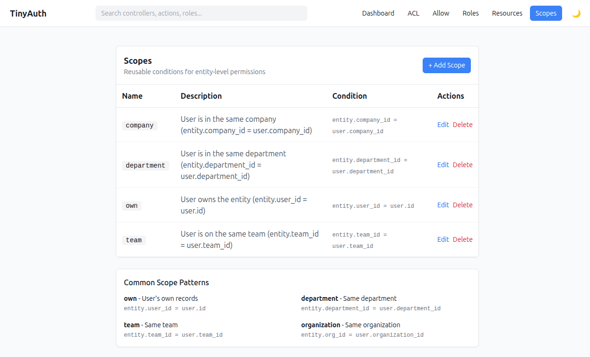

# Scopes

Scopes define reusable conditions that limit resource access.



## Overview

A scope compares a field on the entity with a field on the user to determine
access.

### Built-in scope pattern

The basic scope pattern:

```text
entity.{entity_field} === user.{user_field}
```

### Creating scopes

1. Go to `/admin/auth/scopes`.
2. Click **Add Scope**.
3. Enter:
   - **Name** — identifier (e.g. `own`, `team`, `department`)
   - **Description** — what this scope does
   - **Entity Field** — field on the entity to check
   - **User Field** — field on the user to compare

### Common scopes

| Name | Entity Field | User Field | Description |
|------|-------------|------------|-------------|
| `own` | `user_id` | `id` | User owns the entity |
| `team` | `team_id` | `team_id` | User is on same team |
| `department` | `department_id` | `department_id` | User is in same department |
| `company` | `company_id` | `company_id` | User is in same company |

## Database schema

```sql
CREATE TABLE tinyauth_scopes (
    id INT AUTO_INCREMENT PRIMARY KEY,
    name VARCHAR(50) NOT NULL UNIQUE,
    description VARCHAR(200),
    entity_field VARCHAR(100) NOT NULL,
    user_field VARCHAR(100) NOT NULL,
    created DATETIME,
    modified DATETIME
);
```

## Using scopes

When assigning resource permissions, you can optionally attach a scope:

| Role | Ability | Scope | Effect |
|------|---------|-------|--------|
| user | edit | `own` | Can edit own articles |
| moderator | edit | (none) | Can edit all articles |
| user | view | (none) | Can view all articles |

### Scope evaluation

```php
// Scope: own
// entity_field: user_id
// user_field: id

// For an Article entity and a User identity:
$canAccess = $article->user_id === $user->id;
```

## Advanced: custom scope logic

For complex conditions not covered by field comparison, extend the scope
evaluation in your policy:

```php
public function canEdit(IdentityInterface $user, Article $article): bool
{
    $service = new TinyAuthService();

    // Check base permission with scope
    if ($service->canAccessResource($user, $article, 'edit')) {
        return true;
    }

    // Custom logic: editors can edit unpublished articles
    if ($user->role === 'editor' && !$article->is_published) {
        return true;
    }

    return false;
}
```

## Programmatic scope management

```php
$scopesTable = $this->fetchTable('TinyAuthBackend.Scopes');

// Create a new scope
$scope = $scopesTable->newEntity([
    'name' => 'organization',
    'description' => 'Same organization as user',
    'entity_field' => 'organization_id',
    'user_field' => 'organization_id',
]);
$scopesTable->save($scope);

// Find scope by name
$ownScope = $scopesTable->find()
    ->where(['name' => 'own'])
    ->first();
```

## Scope resolution

When checking permissions with a scope:

```php
use TinyAuthBackend\Service\TinyAuthService;

$service = new TinyAuthService();

// This checks:
// 1. Does the user's role have 'edit' ability on the Article resource?
// 2. If a scope is attached, does the entity match the scope condition?
$canEdit = $service->canAccessResource($user, $article, 'edit');
```

## Best practices

::: tip Keep scopes small
1. **Keep scopes simple** — one condition per scope.
2. **Use descriptive names** — `own`, `team`, not `scope1`.
3. **Document scopes** — clear descriptions help administrators.
4. **Test scope conditions** — verify field names are correct.
5. **Handle null fields** — consider what happens if `entity_field` is null.
:::
